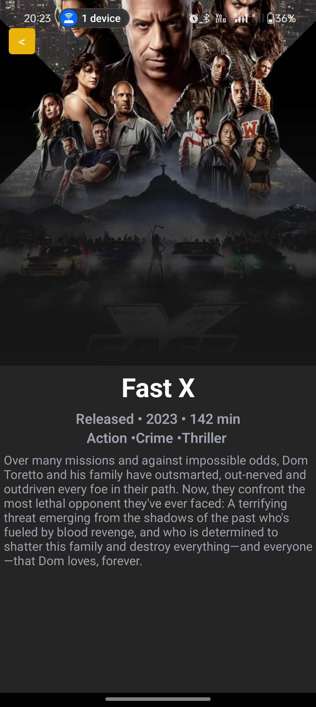

# Movies

 

Movies App is a mobile application built with React Native that allows users to explore and discover information about movies. It utilizes the TMDB API to fetch movie data and provides various features like searching for movies, viewing movie details.

## Quick Start

Clone the repository and do following:

1. Clone the repository:
```bash
git clone https://github.com/ScaryWings83289/movies_app.git
cd movies-app
```

2. Install dependencies:
```bash
# Install dependencies for server
yarn install
```

3. Configure the TMDB API credentials in the project. Add your **API_KEY** in the url.ts file.

4. Start the server:
```bash
# Run the client 
yarn start
```

## Features

- Search for any movie
- View detailed information and synopsis of movies

## Technologies Used

- React Native
- TMDB API
- Axios

**SCREENSHOTS:**

Home Screen:


Search Screen:


Movie Details Screen:



Genre Filters:


## Developed With

* [Visual Studio Code](https://code.visualstudio.com/) - A source code editor developed by Microsoft for Windows, Linux and macOS. It includes support for debugging, embedded Git control, syntax highlighting, intelligent code completion, snippets, and code refactoring
* [NodeJS](https://nodejs.org/en/) - A JavaScript runtime built on Chrome's V8 JavaScript engine.
* [React native](https://reactnative.dev/) - React Native is an open-source UI software framework created by Meta Platforms, Inc. It is used to develop applications for Android, Android TV, iOS, macOS, tvOS, Web, Windows